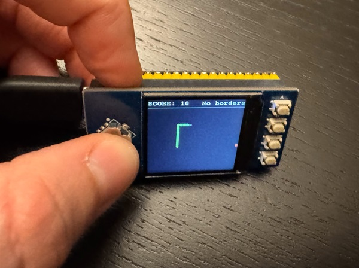

# PicoOne

Playground project for MCU development with a tiny screen.

## Supported features

The snake game.

## Hardware

* [Waveshare 1.3-inch LCD Display Module](https://www.waveshare.com/pico-lcd-1.3.htm)
* [Raspberry Pi Pico 2](https://www.raspberrypi.com/products/raspberry-pi-pico-2/) or a compatible RP2350-based development board, e.g. [from Waveshare](https://www.waveshare.com/product/raspberry-pi/boards-kits/rp2350-plus.htm?sku=29371)

## How to build

1. Follow manufacturer's instructions to connect the parts listed above
(soldering may be required for the MCU board's header, unless [pre-soldered](https://www.waveshare.com/product/raspberry-pi/boards-kits/raspberry-pi-pico-2.htm?sku=28572)).
2. Install [Visual Studio Code](https://code.visualstudio.com/Download).
3. Install [Raspberry Pi Pico extension](https://marketplace.visualstudio.com/items?itemName=raspberry-pi.raspberry-pi-pico) -
it should automatically install and configure the RP2350 toolkit. Note that additional steps are required on macOS and Linux.
4. Check out the repository and open the root folder with Visual Studio Code.
5. Follow the prompts to import it as a Pico project.
6. Select "Raspberry Pi Pico Project" on the activity bar.
6. Connect the MCU via USB and choose "Run Project (USB)" - doing so should build and flash the entire project.
